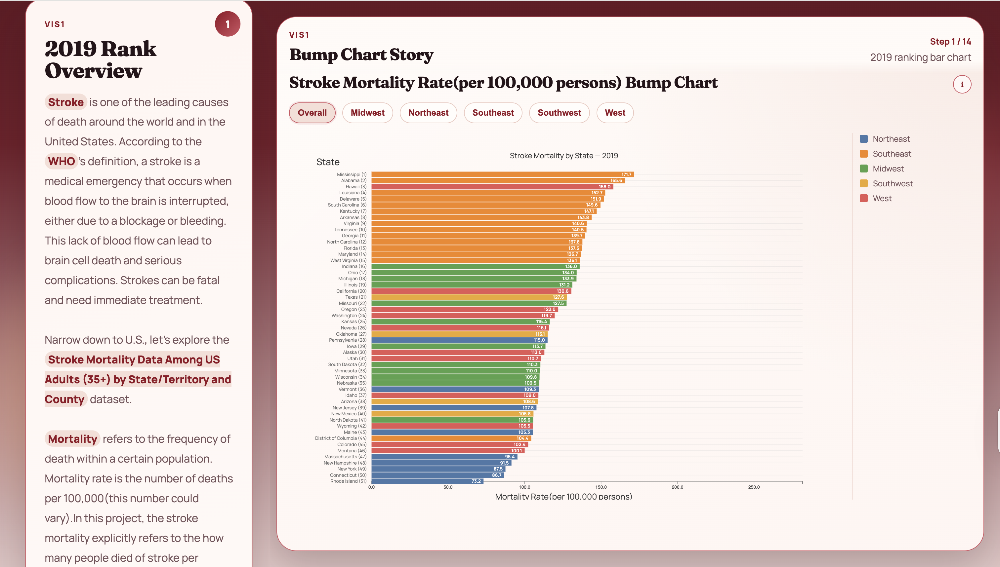
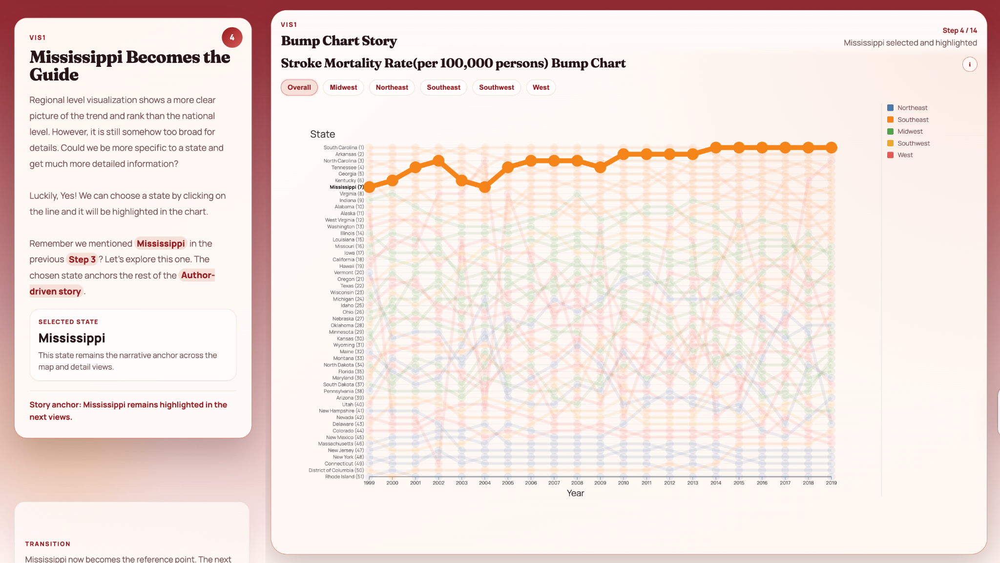
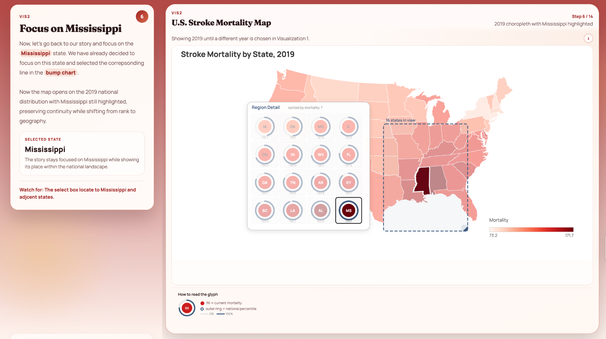
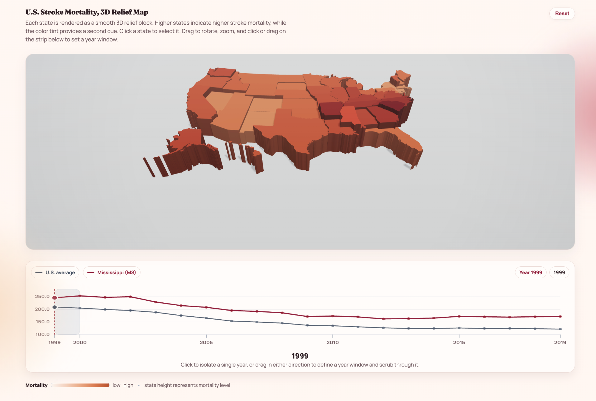
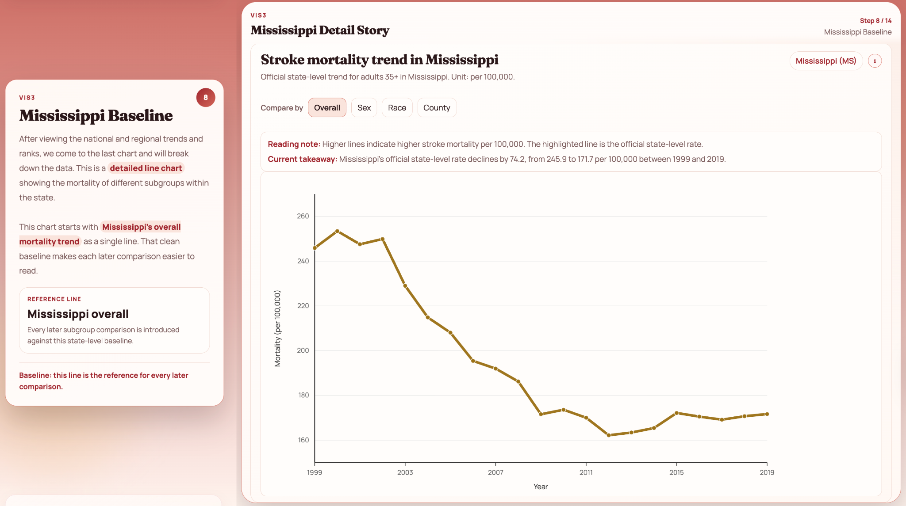

# US Stroke Mortality Visualization

Hello everyone! This is the Final Project of Group 'plot' for CSCI 5609. This is an interactive and scrollytelling visualization project of stroke mortality among US adults (35+) across states, years, and demographic subgroups.

**Group member:** Lechen Shen; Songlin Shang; Ruixing Lu; Jacob Sun; Chenzhi Zhao.

**Dataset:** [Stroke Mortality Data Among US Adults (35+) by State/Territory and County](https://catalog.data.gov/dataset/stroke-mortality-data-among-us-adults-35-by-state-territory-and-county-2019-2021)

**Clarification:** After we downloaded the dataset and conducted the preliminary analysis, we found that it actually included data from 1999 to 2019. However, at the time we compiled this file and the project, the data source webpage and link had been modified to include data from 2019 to 2021. Therefore, we decided to continue our project using the dataset we downloaded and provided in FP1 (Feb 2026), the stroke mortality dataset from 1999 to 2019. The original dataset is available upon request.

---

## How to Use This Website

The experience is split into two modes: a **guided story** (author-driven) and a **free exploration dashboard** (user-driven). We will start with the guided story and then move to the free exploration dashboard. Readers will be able to move within the modes and across the modes by scrolling.

---

### Part 1 — Guided Story (Steps 1–13)

The **Guided Story** has two panels, the panel on the left is the text information and the panel on the right is the box for visualizations. Scroll down continuously to progress through the narrative. The animation and transition of the plotvisualizations will be showed when you scrolling. The visualization on the right are all interactive, feel free to click and interact with them. Your manipulation to the interaction won't affect the **Guided Story** flow, it will move on with our fixed storytelling.

#### VIS 1 · 2019 Rank Overview (Bar Chart)
A static snapshot of stroke mortality rates by state for 2019. Use this to get a sense of which states have the highest burden. 

#### VIS 1 · Bump Chart: 1999–2019 Trends
The bar chart will be trasferred into a **Bump Chart** showing how each state's mortality rank has changed over two decades.  

- **Select Buttons** appear that let you filter the bump chart by US region. Click a region to focus on a subset of states and reduce visual clutter.

- The guided narrative focuses on **Mississippi**, which has persistently high mortality. This focus will be forwarded into every subsequent visualization.

#### VIS 2 · Choropleth Map — 2019 Snapshot
A 2D US map colored by stroke mortality rate for 2019. Darker colors indicate higher mortality.

- Drag a **Selection Box** on the map to highlight a region — the mortality rates for states within that box appear as glyphs on the side.
- The selected state (Mississippi) is highlighted automatically.

#### VIS 2 · 3D Map — Animated 1999–2019 Sweep
The visualization switches to a **3D Map** where each state's height and color both encode its mortality rate. An animation plays through every year from 1999 to 2019.

Interactions available during this step:
- **Click any state** to highlight it and pin the detail panel to that state with comparison to natioanl level.
- **Drag to rotate** the 3D map and view it from different angles.
- **Drag on the timeline strip** at the bottom to define a year window and compare your selected state against the national average.

#### VIS 3 · Detail Line Chart — Mississippi Baseline
The view switches to a **Detailed Line Chart** focused entirely on Mississippi. A single overall mortality line is shown first as a clean reference baseline. Following visualizations will appear on the chart by scrolling:

- Lines for overall, male, and female mortality within the 35–64 age group are added one by one. 

- Racial subgroup lines are revealed one by one.

- Five counties in Mississippi are highlighted one by one against the state average: **Bolivar, Leflore, Humphreys, Hinds, and Sunflower**. These were selected because they reveal the most meaningful variation within the state.

Hover over any line to keep it emphasized while the others fade. This lets you focus on one comparison at a time.

---

### Part 2 — User-Driven Dashboard (Step 14+)

After Step 13, the guided story ends and you enter the **free exploration dashboard**. 

#### What you have:

| Visualization | What it shows |
|---|---|
| **Bar chart** | State mortality ranking for a single year |
| **Bump chart** | Rank changes across all states from 1999–2019 |
| **Choropleth map (2D)** | Geographic distribution of mortality for a given year |
| **3D map** | Height and color encoding of mortality, animated over time by draging the year slider|
| **Detail line chart** | Subgroup breakdowns (sex, race, county) for the selected state |

---

#### What you can do:

| Control | How to use |
|---|---|
| **State selector** | Choose any US state to update all chart, this selector applies to any visualization, you can click the line/point/state on map |
| **Region filter** | Filter the bump chart to a US region |
| **Year slider** | Drag to a specific year to update the 2D and 3D maps |
| **Map selection box** | Drag on the 2D map to select states and view their rates as glyphs |
| **3D map rotation** | Click and drag to orbit; scroll to zoom |
| **Timeline brush** | Drag to select a year range; the line chart updates to that window |
| **Line hover** | Hover any line in the detail chart to emphasize that subgroup |

